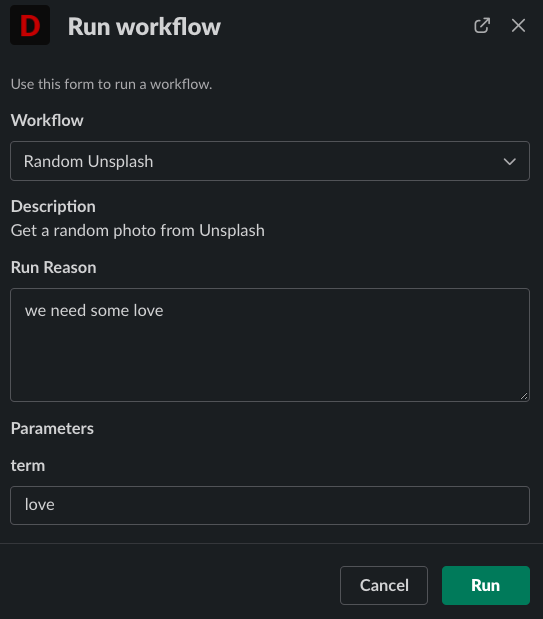
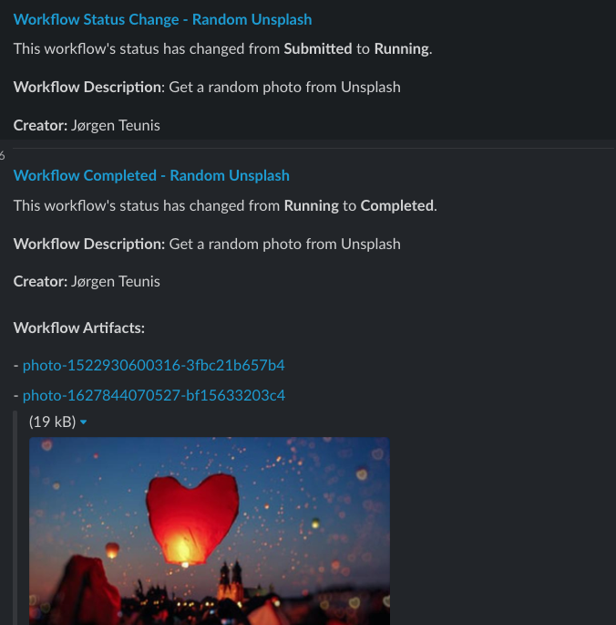

# temporal-dispatch-poc
Small POC project to try out the [Temporal](http://temporal.io/) workflow engine together with [Netflix's](https://github.com/netflix/)
[Dispatch](https://github.com/netflix/dispatch/) Incident Management System.

# Supported workflows
Pure for fun there are two workflows implemented: 
1. Showing a random dog picture from dog.ceo 
2. A similar workflow to get a random photo from Unsplash.

Both workflows have a bit of delay in them to suggest hard work and state changes.

# Project Goals
For this project I had two goals:
1. Get experience with the Temporal Workflow engine.
2. Adding a workflow system to Dispatch through a [generic workflow plugin](https://github.com/Netflix/dispatch/tree/master/src/dispatch/plugins/generic_workflow) 
   that I contributed to Dispatch.
3. Providing an example to others that want to start using Dispatch and that need an easy way to start with workflows. 

# Running POC server
You can either download this project and build it from source or you could download the binaries.

```shell
./td -api=:8888 -temporal=localhost:7233 -queue=dispatch 
```

# Setting up Dispatch with Generic Workflow
Assuming you already have [Dispatch](https://github.com/Netflix/dispatch-docker) and [Temporal](https://github.com/temporalio/docker-compose) running.
The quickest way to test this is to run both from Docker compose.

## Add the plugin
To enable the Generic Workflow Plugin in Dispatch:
1. Login to Dispatch
2. Navigate to: Settings > Projects > default.
3. Click Plugins
4. Click NEW
5. Select Generic Workflow Plugin
6. Save

## Configure plugin
Now you need to configure the plugin to point to the API from this project.
If you run Dispatch in Docker and run this API on the Docker host, you can use the Docker gateway IP to connect.
In that case the URL would be something like: http://172.17.0.1:8888/workflow/

Currently, there is no authentication on the API.

Enable the plugin and save.

## Add workflows
1. Under Settings go to Workflows
2. Add new workflow:
   1. Name: Random dog
   2. Resource ID: random_dog
   3. Description: Gets a random dog picture
   4. Plugin: Generic Workflow Plugin
   5. Enabled: true
   6. SAVE
3. Add new workflow:
    1. Name: Random Unsplash
    2. Resource ID: random_unsplash
    3. Description: Gets a random photo from Unsplash
    4. Plugin: Generic Workflow Plugin
    5. Enabled: true
    6. Workflow Configuration: + add key: term
    7. SAVE

Now run one of the workflows.

# Screenshots
## Start the workflow

## Workflow completed


# TODO
1. Add authentication on the API
2. Maybe break apart Dispatch structs and helper functions so that they are useful for other API's that don't use Temporal
3. Support TLS
4. Docker image

# Dependencies
This project uses [schema-generate](https://github.com/a-h/generate) to generate the 
go structs from the Dispatch JSON schema. This is already done and the structs are in the project so there is
no use to generate it again unless it changes.

# License
[MIT](LICENSE)